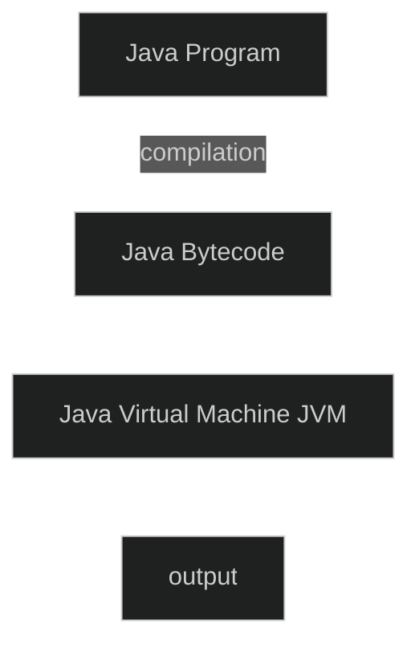

## Overview of Java   
### Why Java   
- object-orientation (The basic java program itself is an object)   
- easy and interpreter based, platform-independent (compiler based code is not always platform independent, the compiled binaries might not run on every hardware, but the existence of a platform independent interpreter (JVM) for Java increases portability allows java code to run on any machine.)   
- web-enabled programming (Java is made to account for network based environments and systems and contains a lot of libraries to account for network and web-enabled programming, for example, computing something in a distributed way, fetching something from a database, etc.)   
- lot of existing libraries   
   
### History of Java   
Origin: Java originated in 1991 at Sun Microsystems. First public version was released in 1995.   
Primary motivation to develop Java was platform independence, architecture neutrality. The idea was to create software that can run without any refactoring for different machines, hence the concept of Java bytecode was introduced.   
Earlier mobile devices ran on Java because of Java's platform independency.   
### Platform Independence   

Java code is compiled to Java Bytecode (optimized java-code) which is interpreted by Java Virtual Machine (JVM) to produce the output, the existence of JVM allows for the same Java Bytecode to run on different machines as JVM handles all the platform inconsistencies itself so the user doesn't have to think about them.   
Due to being an interpreter JVM is slower than a compiler, but it trades off speed with memory safety and reliability of software.   
After the release of Java, it became popular for    
1. WWW based app development in form of Java Applets.    
2. Network, database and internet programming enabled by JDBC (Java Database container).   
   
### Contrast with C/C++   
C++ was made to introduce object orientated principles in writing software, but it lacked to clear modularity and platform independence. To keep the familiarity of C/C++ in Java so that it is easier for programmers to pick up, a lot of Java syntax was kept consistent with C/C++   
Java has a Garbage Collector that keeps track of allocating and freeing memory without the programmer needing to worry about pointers. In C/C++, programmer needs to manually manage memory, which can lead to a lot of memory safety issues like memory leaks, etc.   
Since Java doesn't allow pointers, it is not suitable for system programming like C/C++   
### Common Buzzwords   
Based on the description and history above, we can compile a list of buzzwords for Java   
1. Simple   
2. Secure   
3. Portable   
4. Object-oriented   
5. Robust   
6. Multithreaded (can use multiple CPU threads)   
7. Architecture neutral   
8. Interpreted   
9. High performance (JVM can efficiently perform high fidelity operations on shorter bytecodes)   
10. Distributed (a network of computers doing part of some large work)   
11. Dynamic (in the sense of dynamic binding, abstract methods that work when certain objects are associated with them)   
   
## Basics of Object oriented programming   
### Procedural programming   
In a procedural system, there are functions, and each function solves a particular sub-problem. Combining these functions, one can solve the overall programatic problem.   
Functions take some data, and they act on that data. For example, a function to calculate the GCD takes two numbers as data, and then it acts on those two numbers to produce the output.   
**Code controls data.**   
### "Data controls access to code"   
In an object oriented system, unlike the procedural programming way of code controlling data, the data itself controls what functions can act on it. In this way, the object oriented model brings out more restriction on what functions can act on what data which makes it more reliable.   
### Objects   
An object is an entity with some associated allowed operations.   
### Hierarchical Classification   
An object can be made up of several "smaller" objects.   
### Three core OOP Principles: Encapsulation, Inheritance, Polymorphism   
### Encapsulation   
Binding code and data together. The user of the object cannot access or change the internal implementation of the functions, but can only call the functions and access the property values.   
In Java, encapsulation is implemented using **Classes**.   
Objects are instances of classes.   
### Inheritance   
Property by which one object acquires properties of another, comes from the concept of hierarchical classification.   
Using one class, other classes can be made. If class B is made using class A, then A is the superclass of B and B is the subclass of A. Subclasses are also called derived classes.   
Java implements inheritance using a keyword called extends.   
A Bike class and a Car class can derive from a Vehicle class and they will have all the properties of the Vehicle class along with some other special properties.   
### Polymorphism   
Single interface, multiple methods.   
An interface is a generic class of functions.   
Polymorphism allows different classes to have methods with same name but different implementation. Polymorphism ensures that the classes implement their own code for the same function.   
For example, a triangle class, a circle class and a rectangle class can all have methods for calculation of area called calc\_area(), but the implementation details for every class would be different as per the shape. Still all three different objects can be referenced by using the same interface, because all of them implement the methods of that interface.   
In Java, polymorphism is implemented using Interfaces.   
