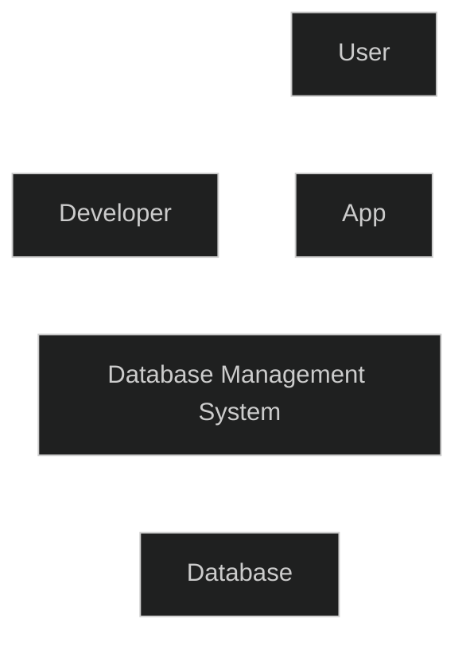

Data represent raw elements and unprocessed facts. It does not carry significance by itself.   
We get information when data is processed, organized and structured.   
Database is a collection of data which contains information relevant to some context.   
DBMS is a collection of interrelated data and set of programs that allow users to access and modify, store and retrieve data in efficient and convenient manner.   
A relational DBMS is a DBMS that follows the **relational data model**. A relational data model uses tables to represent data and the relationships among that data.   
### Course structure   
1. Overview and purpose of DBMS   
2. Relational Model, SQL, Relational Algebra   
3. E-R Model, Relational Database Design   
4. Transaction Management, Concurrency control   
5. Data Storage Management and Indexing   
   
### Week 1 substructure   
1. Philosophy behind database systems   
2. Disadvantages of File systems   
3. Data models   
4. Data abstractions   
5. Database languages   
6. History of RDBMS   
   
   
Data can be stored in file systems with programs to handle different data, but if the size of data increases or number of files increases and the number of programs to handle different data increases, it becomes harder to manage.   
### Other disadvantages of File systems   
- 1.Data redundancy and inconsistency    
   
for example, there are two files: employees and departments, employee file might contain department info, department file might contain employee info, data is ***duplicated***. Also, if employee's department information changes, then that should be updated in department file as well, if one forgets to do so, then the data from two files would be ***inconsistent***.   
- 2. Integrity problems   
   
If the data has certain constraints, for example the budget/some other value should always be greater than zero in some files, then there is no way to stop someone from entering any value into the file. Also, if the constraints change in future or new constraints are added, then there is no way to handle and synchronize those constraint changes across all the different files.   
- 3. Data isolation   
   
Data is stored in different files/formats which can lead to data isolation and less interoperability and need to write new programs to handle different data increases   
- 4. Atomicity of updates   
   
Failures to update database everywhere completely with only partial changes carried out in some-places may leave database in inconsistent state. Either all data should be updated or no data should be updated.   
- 5. Concurrent access by multiple users   
   
If two administrators are updating data at the same time, then without any control or resolution of changes, it might lead to inconsistency in data.   
- 6 . Security problems   
   
Provide access to some people but not everyone on the system   
### Data abstraction   
Unlike file system, The Database is abstracted away from the user. The Database Management system sit in between of users and the actual database.   



There are three levels of Data Abstraction:   
1. Physical Level (describes how the data is stored physically, i.e. what hard disk, etc.)   
2. Logical Level (describes what data is stored and what are the relationships between those data, at this level the user doesn't need to think about where or how the data is stored, only what the data is and how it is connected to other data)   
3. View Level (application level abstraction, where the application can choose to display data or hide data in various ways, for example, hiding the employees salary for security reasons, multiple views are possible for single database as per the requirements of the application and analysis)   
   
### Data models   
Data model is a collection of conceptual tools for describing   
- Data   
- Data Relationships   
- Data Semantics   
- Data constraints   
   
Few commonly used data models:   
- 1.Relational model   
   
Relational data model is a collection of tables to represent data and the relationships among that data, with fixed number of attributes.   
Each table contains records with fixed types.   
- 2. Entity-Relationship data model   
   
Contains objects/entities and relationships among those entities.   
- 3. Object-based data models   
   
Extends the ER model with notions of Object oriented programming.   
- 4. Semi-structured data model   
   
permits the specification of data where individual data items of the same type may have different sets of attributes.   
# Relational data model   
All data is stored in various tables, each table has multiple columns with unique names. Each table contains records of a particular type. Each row corresponds to a record with fixed number of attributes with fixed types.   
This method was proposed by Edgar Frank "Ted" Codd for which he received the Turing Award in 1981.   
### Database Schema   
The overall design of the database is called the **Database schema**.   
There are three types of database schemas:   
1. Logical schema (describes the database design at a logical level)   
2. Physical schema (describes design at a physical level)   
3. Subschema (describes different views of database)   
   
Programmers use logical schema to constructs applications based on the database. An analogy for logical schema is the type declarations in programming.   
### Instance of Database   
The actual content of the database at a particular point in time is called Instance. Instances can change.   
The analogy can be the value of a variable at a particular point in time.   
## DDL (Data Definition Language)   
DDL is used to define the database schema.   
DDL helps in defining the types of attributes in a table   
```
create table instructor (
ID char(5),
name varchar(20),
dept_name varchar(20),
salary numeric(8, 2)
);
```
In the above example, four attributes are defined and are given fixed types using DDL.   
### Data Dictionary   
DDL compiler generates a set of table templates which are stored in a ***data dictionary***. Data dictionary contains metadata that can be used to store the details about each attribute in the schema.   
### DDL constraints   
DDL provides the tools to specify four types of constraints:   
- ** **1. Domain Constraints   
   
This constraint helps in defining types for every attribute, for example, integer, character types, date/time etc.   
-  2. Referential Integrity   
   
Two tables can have the same attribute, this allows for referencing the same data in multiple tables. Referential integrity ensures that the value that appears in one attribute in one table also appears in the same attribute in another table.   
-  3. Assertions   
   
Ensure that any other condition that is defined is always satisfied in the Database. Domain constraints and referential integrity are special forms of assertions.   
-  4. Authorization   
   
Give access of specific data to specific users. In other words, which user can access which data.   
## DML (Data Manipulation Language)   
Enables users to access and manipulate data   
### Procedural DML   
requires users to specify what data is needed and how to get that data (for example, Oracle PL/SQL)   
### Declarative DML   
requires users to specify what data is needed without specifying how to get that data (for example, standard SQL)   
# SQL   
SQL is non procedural language, which means that one doesn't need to write step by step commands.   
SQL returns a single table with the specified query, for example if one wants to know all the names of all the professors in CSE department, the query would be:   
```
select name
from instructor
where dept_name = 'cse'
```
SQL is embedded into some high level language or application.   
There are two ways SQL can be used:   
1. APIs provided by the database (ODBC, JDBC)   
2. Language extensions for Python, Java, etc.   
   
# History of Database Systems   
### 1950s   
- Data processing using magnetic tapes for storage, tapes provided only sequential access.   
- Punched cards for input   
- Hierarchical models   
   
### 1960s and 1970s   
- Hard disks allowed direct access to data   
- Network and hierarchical data models in widespread use   
- Relational data model is defined by Ted Codd   
- IBM begins System R prototype   
- UC Berkeley begins Ingres prototype   
- Oracle releases first commercial relational database   
   
### 1980s   
- SQL becomes industry standard   
- Relational model prototypes are commercialized   
- Parallel and distributed database systems are made by IBM, Teradata   
- Object-oriented database sytems are developed   
   
### 1990s   
- Large decision support and data-mining applications   
- large multi-terabyte warehouses   
- Emergence of Web   
   
### 2000s   
- Big data storage systems came into picture (Google BigTable, Yahoo PNuts, Amazon NoSQL systems)   
- MongoDB NoSQL   
- Big data analysis: beyond SQL (map reduce framework)   
   
### 2010s   
- SQL Reloaded   
- SQL front end to Map Reduce systems   
- Massively parallel database systems   
- Cloud based storage and service   
- Graph Database to store nodes and relationships instead of tables or documents (Neo4J)   
   
   
