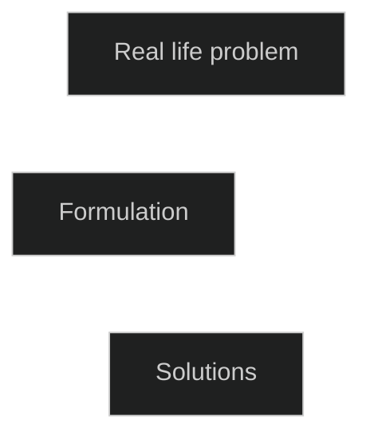

- Introduction   
- What is optimization   
- Unconstrained and constrained optimization   
- Application of optimization   
- Some examples of modelling optimization problems   
- Notations   
   
## What is optimization   
Optimization refers to the action of making the best or most effective use of a situation or resource.   
### **Dictionary definition**   
An act, process or methodology of making something, like a design, system or decision as fully perfect, function, or effective as possible.   
### **Wikipedia's definition**   
An optimization problem consists of maximizing or minimizing a real function by systematically choosing input values from within an allowed set and computing the value of the function.   
### Mathematical optimization   
Mathematical optimization optimizes any **objective function** by systematically analyzing **decision variables** and **constraints** to find the most efficient or effective solution.   
Eventually it turns into finding the minimum and maximum of the objective function.   
### Unconstrained optimization   
Finding the maximum or minimum of a function when there is no constraint or restrictions on the input or decision variables, this can involve searching for a local extremum, and comparing it with other local extrema to find the global extrema.   
### Constrained optimization   
Constrained optimization requires the decision variables to satisfy some constraints. Constraints can be equality or inequality constraints.   
### Application of optimization   
Engineering, manufacturing, transportation: finding the optimal fuel efficient or shortest route, finance, economics, marketing.   
## Some Examples of Modelling Optimization Problems   

Examples 1-3 are referenced from "A Gentle Introduction to Optimization" by B. Guenin, J. Konemann, L. Tuncel   
The fourth example is referenced from "An Introduction to Optimization: Foundation and Fundamental Algorithms" by Niclas Andr'easson.   
### Example 1   
**Objective** is to find the rectangle with the largest area among the rectangles with the given perimeter $L$.   
Here the **decision variables** are the length $x\_1$ and the height $x\_2$ of the rectangle.   
Since we are looking for the rectangle with maximum area, the  **objective function** is $f(x\_1, x\_2) = x\_1x\_2$.   
The main **constraint** is the perimeter, i.e. $2(x\_1+x\_2)=L$. Further constraints are that $x\_1, x\_2$ should not be negative.   
Combining the description from above, we can write the optimization problem as:   

$$
\max_{x_1,x_2\in R}\{f(x_1,x_2) \mid 2(x_1+x_2)=L, x_1\geq 0,x_2\geq 0\}
$$
The pipe in the equation above can be read as "subject to", i.e. the objective function is subject to the constraints. A colon can also be used in place of pipe.   
### Example 2   
**Objective** is to find the dimensions of a solid cylinder having a given volume $V$ and minimal surface area.   
Decision variables are radius $r$ and the height $h$ of the cylinder.   
We are looking for a cylinder with minimum surface area, hence the objective function that we need to minimize is the surface area of the cylinder: $f(r, h)=2\pi r^2+2\pi rh$   
Constraints are $\pi r^2h=V$, $r,h\geq 0$   
Putting everything together, the optimization problem can be stated as:   

$$
\min_{r,h\in R}\{f(r, h)\mid\pi r^2h=V, r\geq 0, h\geq 0\}
$$
### Example 3   
**Objective**: A company manufactures four products, requiring time on two machines and engages two types of workers: skilled and unskilled.   
| Product | Time on machine 1 | Time on machine 2 | Hours of skilled worker | Hours of unskilled worker | Unit sale price |
|:--------|:------------------|:------------------|:------------------------|:--------------------------|:----------------|
|       1 |                12 |                 6 |                       8 |                         7 |            8000 |
|       2 |                 8 |                 6 |                       5 |                         8 |            6500 |
|       3 |                 6 |                 5 |                       6 |                         7 |            6000 |
|       4 |                 6 |                 4 |                       7 |                         5 |            4000 |

In each month, 600 hours are available on machine 1 and 500 hours on machine 2   
Each month the company can purchase up to 700 hours of skilled labor at 200 per hour and up to 650 hours of unskilled labor at 100 per hour.   
The company wants to determine how much of each product it should produce each month and how much labor to purchase in order to maximize its profit (sales - labor costs)   
Pretty heavy objective but still not as complex as the real world, how would we break it down?   
Let $x\_i$ represent the number of units of the $i^{th}$ product to be produced where $ i\in \{1,2,3,4\}$.   
Let $y\_s$ and $y\_u$ be the skilled and unskilled units of labor to be purchased.   
$x\_1, x\_2, x\_3, x\_4, y\_s, y\_u$ are the **decision variables**.   
Assuming that all manufactured products are sold then the **objective function** for company's profit can be formulated as:   

$$
\text{Company's Profit} \\= 8000x_1+6500x_2+6000x_3+4000x_4-(200y_s+100y_u)
$$
The **constraints** can be defined as follows:   
Since, machine 1 cannot be used for more than 600 hours and machine 2 cannot be used for more than 500 hours, the constraints for machines are:   
For machine 1: $12x\_1+8x\_2+6x\_3+6x\_4\leq 600$   
For machine 2: $6x\_1+6x\_2+5x\_3+4x\_4\leq 500$   
Since company can purchased maximum 700 units of skilled labor and maximum 650 units of unskilled labor, the constraints on manpower are:   
For skilled labor: $8x\_1+5x\_2+6x\_3+7x\_4\leq y\_s\leq 700$   
For unkilled labor: $7x\_1+8x\_2+7x\_3+5x\_4\leq y\_u\leq 650$   
The final constraint is that each of the variables can have non-negative values only.   
Finally, combining all these, the optimization problem can be written as:   

$$
\max8000x_1+6500x_2+6000x_3+4000x_4-(200y_s+100y_u)\\\text{subject to}\\12x_1+8x_2+6x_3+6x_4\leq 600\\6x_1+6x_2+5x_3+4x_4\leq 500\\8x_1+5x_2+6x_3+7x_4\leq y_s\\7x_1+8x_2+7x_3+5x_4\leq y_u\\y_s\leq 700\\y_u\leq 650\\x_1,x_2,x_3,x_4,y_s,y_u\geq 0
$$
### Example 4   
Shifts, duty hours, and staff requirements for an organization are:   
|          Shift |   1 |   2 |    3 |     4 |     5 |     6 |
|:---------------|:----|:----|:-----|:------|:------|:------|
|         Timing | 0-4 | 4-8 | 8-12 | 12-16 | 16-20 | 20-24 |
| Required Staff |   8 |  10 |   12 |    10 |     8 |     6 |

Each member of staff works in 8 hour shifts. The objective is to fulfil the demand with the least total number of staffs.   
Let $x\_i$ represent the number of staffs whose first shift is $i$ where $i=1,2,3,4,5,6$   
Objective function that we need to minimize is:    

$$
f(x)=\sum_{i=1}^6x_i
$$
decision variables are $x\_1,x\_2,x\_3,x\_4,x\_5,x\_6$   
Constraints:   
The staff that started working during shift 1 would continue working in shift 2. Since the required staff for shift 2 should be greater than or equal to 10 and two staffs are working in shift 1, their combined staff-manpower should be greater than 10, we can say:   
$x\_1+x\_2\geq 10$   
The staff that started working in shift 2 will continue working in shift 3, then the staff that started working in shift 3 will continue working in shift 4, and so on similarly the staff that started working in shift 6 will continue working in shift 1. Hence:   
$x\_2+x\_3\geq12$   
$x\_3+x\_4\geq10$   
$x\_4+x\_5\geq8$   
$x\_5+x\_6\geq6$   
$x\_6+x\_1\geq8$   
Further constraints: $x\_i>0$ and $x\_i\in\mathbb{Z^+}$   
Finally, the optimization problem can be stated as:   

$$
\min_{x_1,...,x_6}\sum_{i=1}^6x_i\\\text{subject to}\\
x_1+x_2\geq10\\
x_2+x_3\geq12\\
x_3+x_4\geq10\\
x_4+x_5\geq8\\
x_5+x_6\geq6\\
x_6+x_1\geq8\\
x_i\geq0\\x_i\in\mathbb Z^+
$$
One possible solution for this problem is the vector $\vec{x} = (4, 6, 6, 4, 4, 4)^T$ where each component of the vector corresponds to one of the $x\_i$.   
## Notations   
If $X$ is a set, $x\in X$ means an element that belongs to the set $X$, $x\notin X$ means that $x$ is not an element of $X$.   
Braces are usually used to represent sets, for example $\{x:x\in\mathbb R, x > 10\}$ is a set of all real numbers greater than 10.   
$X\subset Y$ means that $X$ is a subset of $Y$   
$X \setminus Y$ means the set of all elements of $X$ that are not in $Y$, Note: $X \setminus Y\subset X$   
$f: X→Y$ means f is function from the set $X$ to the set $Y$.   
$:=$ denotes assignment, $x:=y$ means $x$ becomes $y$.   
$\mathbb R$ denotes the set of real numbers   
$\mathbb R^n$ denotes n dimensional real vector space, i.e. set of column n-vectors with real components.   
   
   
